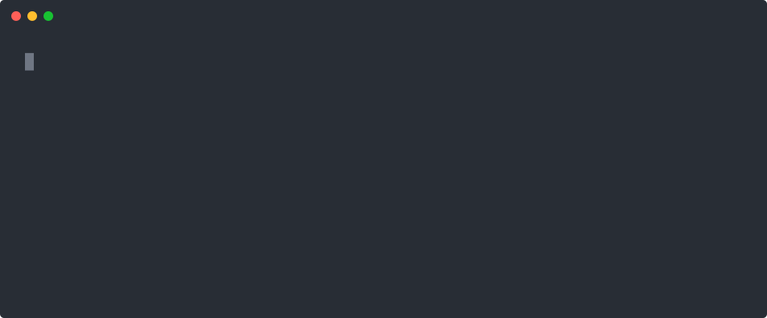
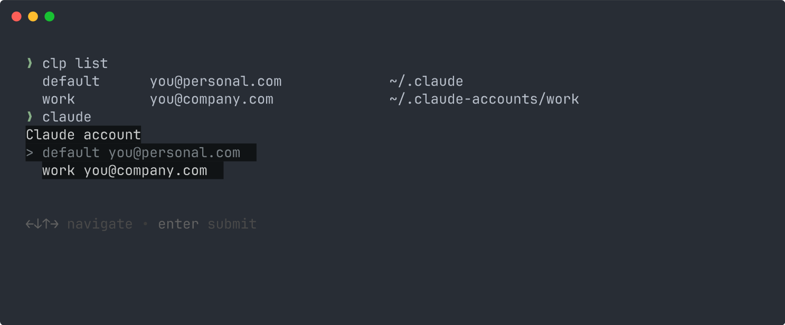

# claude-account-switcher

Run more than one Claude account from one machine, pick which one at launch, and
keep your config in sync between them.

Claude Code stores its sign-in in one place. Signing into a second account means
signing out of the first, and signing back in later. If you have a personal
account and a work one, or you want to spread usage across two subscriptions,
that gets old fast.

This gives you named profiles instead:

<p align="center">
  
</p>

<sub>Recorded against two throwaway accounts. The `starting Claude Code` line
stands in for Claude Code itself, so the config directory each choice hands it
is visible.</sub>

Sessions on different accounts run at the same time without interfering, because
each profile has its own config directory and its own credentials.

## Contents

[What it does](#what-it-does) · [What it does not do](#what-it-does-not-do) ·
[Requirements](#requirements) · [Install](#install) · [Commands](#commands) ·
[Configuration](#configuration) · [Sync modes](#sync-modes) ·
[Backups](#backups) · [Status line](#status-line) ·
[Keyboard shortcut](#keyboard-shortcut) · [How it works](#how-it-works) ·
[Caveats](#caveats) · [Troubleshooting](#troubleshooting) ·
[Uninstall](#uninstall) · [Development](#development)

## What it does

- **A picker on launch.** Bare `claude` asks which account. `claude @work` skips
  the question. Anything with arguments (`claude mcp list`, `claude -p`, a hook,
  a script) goes straight to your default account and never blocks on a prompt.

  

- **Shared config.** Profiles borrow your `CLAUDE.md`, skills, plugins, agents,
  settings and session history by symlink, so a second account is not a stock
  install. You choose what gets shared at install time.
- **Synced MCP servers and project trust.** These live inside `.claude.json`,
  which cannot be symlinked, so they are merged between profiles instead. The
  merge runs in both directions and handles deletions.
- **Automatic backups.** Anything that overwrites or deletes config you did not
  ask it to change saves a copy first, including sign-in tokens before a profile
  is removed.
- **A status line badge** showing which account the session is on, in its own
  colour per profile.
- **An optional keyboard shortcut** that opens the picker in a new terminal.

## What it does not do

- **It does not share connectors.** Gmail, Drive, Slack and the rest configured
  on claude.ai are held server-side against the account, and Claude Code fetches
  them with that account's token. Nothing local can move them. Connect them once
  per account.
- **It does not touch `~/.claude`.** Your existing account stays exactly where it
  is, as the profile named `default`. Uninstalling leaves it untouched.
- **It does not handle your credentials.** You sign in with `/login` as normal.
  The tool only decides which directory Claude Code reads and writes.
- **It does not work in scripts.** `clp` and the `claude` wrapper are shell
  functions in interactive shells. See [Caveats](#caveats).

## Requirements

- Claude Code, already signed in once
- `bash` and `python3`
- `jq` for the status line
- `gum` or `fzf` for a nicer picker (optional, falls back to a numbered menu)

Developed and tested on Linux. Nothing in it is Linux-specific and the known
GNU-isms have been removed, but macOS is untested and needs bash 4 or newer,
since `/bin/bash` there is still 3.2. The keyboard shortcut step knows about
Hyprland and Omarchy; on anything else it writes the launcher and leaves the
binding to you.

## Install

```bash
git clone https://github.com/TheAmbitiousCorry/claude-account-switcher.git && cd claude-account-switcher && source ./install.sh
```

`source` rather than `./install.sh` so that `clp` works the moment it finishes.
A script cannot load a shell function into the shell that launched it, so the
plain form has to end by telling you to run
`source ~/.claude-accounts/switcher.sh` or open a new terminal. Both install the
same thing.

The installer asks what to share, whether to merge one way or both, whether you
want the status line, and whether to bind a keyboard shortcut. Re-run it any time
to change your answers. Every file it edits is backed up first.

Then:

```bash
clp add work                 # create a second profile
clp use work                 # launch it, then run /login
claude                       # from now on, pick an account
```

### Updating

The scripts are copied into `~/.claude-accounts` and `~/.local/bin`, so the
clone is disposable once the installer finishes. That also means `git pull` on
its own changes nothing about what runs:

```bash
cd claude-account-switcher && git pull && source ./install.sh
clp version                  # what is installed, and whether it is behind
```

`clp version` compares the installed commit against the checkout it came from
and tells you when they differ.

## Commands

| Command | What it does |
| --- | --- |
| `claude` | Picker, when more than one profile exists |
| `claude @work` | Launch a specific profile |
| `claude mcp add …` | Asks which account, when run in a terminal: `mcp`, `plugin` and `config` write account-owned state (override the list with `CLAUDE_ACCOUNTS_PICK_SUBCOMMANDS`, empty means never ask) |
| `claude -p "fix it"` | Other arguments mean no picker, uses default |
| `CLAUDE_PROFILE=work claude` | Choose by environment, works in scripts |
| `clp list` | Every profile and the account it is signed in as |
| `clp add <name>` | Create a profile, then sign in with `/login` |
| `clp use <name> [args]` | Launch that profile, same as `claude @<name>` |
| `clp remove <name>` | Delete a profile, after backing up its sign-in |
| `clp backups` | Saved copies, oldest first, with paths |
| `clp version` | Installed commit, install mode, and update status |
| `clp help` | The above, in your terminal |

Tab completion covers the subcommands, and profile names after `use` and
`remove`.

The command is `clp`, not `cp`: shadowing coreutils `cp` in every interactive
shell is not worth two saved keystrokes.

## Configuration

`~/.claude-accounts/config.sh`, written by the installer and safe to hand-edit.
Re-running the installer rewrites it and keeps a `.bak` copy of the old one.

```bash
CLAUDE_ACCOUNTS_SYNC_MODE=two-way        # two-way | from-default | isolated
CLAUDE_ACCOUNTS_SYNC_KEYS="mcpServers projects"
CLAUDE_ACCOUNTS_BACKUP_KEEP=10           # copies per file, 0 turns backups off

CLAUDE_ACCOUNTS_SHARED=(                 # symlinked from ~/.claude into each profile
  CLAUDE.md
  skills
  plugins
  settings.json
)

CLAUDE_PICK_ARGS=""                      # extra arguments for shortcut launches
CLAUDE_PICK_CD="$HOME/code"              # where shortcut sessions start
```

Environment variables, for overriding without editing the file:

| Variable | Effect |
| --- | --- |
| `CLAUDE_PROFILE` | Use this profile, skip the picker |
| `CLAUDE_ACCOUNTS_ROOT` | Where profiles live, default `~/.claude-accounts` |
| `CLAUDE_ACCOUNTS_BACKUP_DIR` | Where backups go, default `<root>/backups` |
| `CLAUDE_ACCOUNTS_BACKUP_KEEP` | Copies kept per file, `0` disables |
| `CAS_INPUT` | Answer the installer from a file, for unattended installs |

## Sync modes

`.claude.json` holds shared config and account identity in the same file, so it
cannot be symlinked. Instead the keys in `CLAUDE_ACCOUNTS_SYNC_KEYS` are merged
just before launch, and identity keys are never touched.

- **`two-way`** propagates additions and deletions in both directions. The merge
  is three-way against a snapshot of the last sync, kept in
  `<profile>/.sync-base.json`. That snapshot is what makes deletion work: without
  it there is no way to tell "added over there" from "removed over here", and
  every removal comes straight back on the next launch. Where both sides changed
  the same entry, the default wins and says so on stderr.
- **`from-default`** treats your main account as the source of truth and never
  writes to it. Entries only the profile has are left alone.
- **`isolated`** shares nothing. Every account configures itself.

Switching modes is safe: the base snapshot is rewritten to match the mode, so a
`from-default` run does not make the next `two-way` run think the default deleted
everything.

## Backups

Nothing here asks you to copy files aside first. Before anything overwrites or
deletes config that you did not ask it to change, it is saved to
`~/.claude-accounts/backups/`:

- `~/.claude.json`, before a two-way sync merges the other account's servers in
- a profile's own `.claude.json`, on the same merge
- a profile's `.claude.json` and `.credentials.json`, before `clp remove`
  deletes it

An unchanged file is not copied again, so frequent launches do not push real
history out. The newest ten per file are kept. The directory is `0700` and the
copies `0600`, because credential files are sign-in tokens.

Restore by copying one back:

```bash
clp backups
cp ~/.claude-accounts/backups/default-claude-20260101-120000-00.json ~/.claude.json
```

The installer's own backups are different: it writes `<file>.bak.<timestamp>`
next to each file it edits, including `.bashrc`, `settings.json` and your
Hyprland config.

## Status line

Optional, chosen at install time. It renders the chat title, then a coloured
badge with the profile name and the email that profile is signed in as:

```
Fix the login redirect  ● work  you@company.com
```

The title is the name set with `/rename`, or else the one Claude Code generates
for the session. It is cut at 40 characters (`TITLE_MAX` in the script), and a
chat with no title yet shows only the badge.

Colours are derived from the profile name, so a new account is visually distinct
without configuration. Override them in `~/.claude-accounts/colors.conf` as
256-colour codes:

```
work=196
client=21
```

The account cannot change mid-session, so the badge is rendered once per session
and cached. Claude Code calls a status line on a 300ms debounce during active
work, and parsing a 60KB config that often would be waste. The title is the
exception: it changes as the conversation moves, so it is read on every run.

If the unslop hook from [nibble-skills](https://github.com/Nibble-A-Bit/nibble-skills)
ran in the session, a `✎ unslop` segment follows the email. It reads the state
file the hook writes at session start, so it shows that the mode is live, not
that the plugin is installed. Without that file it renders nothing.

One trade-off, and it is not this tool's doing: Claude Code hides most footer
keyboard hints when any custom status line is configured, including
`esc to interrupt` and `? for shortcuts`. Skip the status line at install time if
you would rather keep them.

## Keyboard shortcut

`claude-pick` is a real executable in `~/.local/bin`, not a shell function, so a
desktop launcher or keybinding can call it. It shows the picker in the terminal
window the session is about to occupy, so the choice and the session share one
window.

The installer can bind it for Hyprland and Omarchy. Worked examples for both, and
notes for other desktops, are in [docs/hyprland.md](docs/hyprland.md).

## How it works

`CLAUDE_CONFIG_DIR` relocates everything Claude Code keeps per user: settings,
credentials, session history, and `.claude.json`. Point it at a different
directory and you get a completely separate installation, including a separate
sign-in.

That isolation is total, which is the point and also the problem. A fresh profile
has no `CLAUDE.md`, no skills, no plugins, no MCP servers. So each profile
symlinks the shared pieces back to `~/.claude`, and `.claude.json` gets a
three-way merge for the keys that matter.

`.claude.json` cannot be symlinked because it holds both shared config
(`mcpServers`, `projects`) and account identity (`oauthAccount`, `userID`, usage
and entitlement caches) in one file. Share the whole thing and whichever account
signed in last overwrites the identity for both. So only the shared keys move,
and identity is never copied.

Full detail, including why symlinking `plugins` carries plugin-provided MCP
servers across, is in [docs/how-it-works.md](docs/how-it-works.md).

## Caveats

- **`clp` is a shell function.** It exists in interactive shells that source
  `~/.claude-accounts/switcher.sh`, which the installer adds to your rc file.
  It is not available in scripts, `bash -c`, cron, or another user's shell.
  `claude-pick` is a real executable and works anywhere.
- **External wrappers bypass the picker.** `timeout claude`, `env claude`,
  `xargs`, `sudo` and `nohup` invoke the binary directly, because none of them
  can call a shell function. Those get your default account. Use `claude @work`
  or `CLAUDE_PROFILE` when you need a wrapper.
- **`projects` is noisy.** It carries trust decisions and allowed tools, which
  rarely collide, but also per-directory prompt history, which changes every
  session. Use both accounts in the same directory and you will hit the conflict
  path often. Drop `projects` from `CLAUDE_ACCOUNTS_SYNC_KEYS` if that bothers
  you; session transcripts are unaffected either way.
- **There is a small write race.** In `two-way` mode the sync writes
  `~/.claude.json`, and a live session on your default account writes it too. The
  file is re-read immediately before writing to keep the window small, but it
  cannot be closed entirely without a lock Claude Code does not participate in.

## Troubleshooting

**`clp: command not found`**
Your shell has not sourced the switcher. `source ~/.claude-accounts/switcher.sh`,
or open a new terminal. In a script, this is expected: use `CLAUDE_PROFILE` or
`claude-pick` instead.

**Bare `claude` does not show a picker**
It only appears with more than one profile. Check `clp list`. Any argument at all
skips the picker by design, so hooks and scripts never block.

**The picker appeared but the wrong account is signed in**
`clp list` shows what each profile actually holds. A profile with no sign-in
reads `not signed in`; run `clp use <name>` and `/login`.

**No status line badge**
Restart Claude Code, it reads `settings.json` at startup. Confirm `jq` is
installed and `statusLine.command` points at
`~/.claude-accounts/statusline.sh`.

**The keyboard shortcut launches Claude without asking**
The binding is calling `claude` rather than `claude-pick`, or passing arguments
that skip the picker. See [docs/hyprland.md](docs/hyprland.md).

**MCP servers are missing on the second account**
They sync just before launch, so start the profile once through `clp use` or the
picker. Check `CLAUDE_ACCOUNTS_SYNC_MODE` is not `isolated`, and that
`mcpServers` is in `CLAUDE_ACCOUNTS_SYNC_KEYS`.

**A deleted MCP server keeps coming back**
That is `from-default` mode doing its job: the default account is authoritative
and is never written. Delete it on the default account, or switch to `two-way`.

**`install.sh` says it needs a terminal**
It asks questions, so it refuses to run where there is no `/dev/tty`: an agent
shell, a CI job, a hook. It changes nothing in that case. Run it from a terminal,
or answer it from a file with `CAS_INPUT`, one line per question. The same
applies to `uninstall.sh`.

**`clp version` says the checkout has moved on**
Re-run `source ./install.sh` in that checkout. Copies do not update themselves.

## Uninstall

```bash
./uninstall.sh
```

Removes the shell hook, the status line setting, the keybinding, and the
installed scripts. It asks separately before deleting profile directories and
before deleting backups, since both hold account sign-ins. `~/.claude` and
`~/.claude.json` are not modified.

## Development

```bash
source ./install.sh --link   # symlink the scripts, so edits here are live
```

The checkout is then part of the installation, and moving or deleting it breaks
the switcher. `clp version` reports `link` so you can tell which kind of install
you are looking at.

The installer and uninstaller can be driven without a terminal, which is how they
are tested against a throwaway `HOME`:

```bash
printf '%s\n' 1 1 1 1 ~/.bashrc n n > /tmp/answers
HOME=/tmp/fakehome CAS_INPUT=/tmp/answers ./install.sh
```

Issues and pull requests welcome.

## License

MIT. See [LICENSE](LICENSE).
